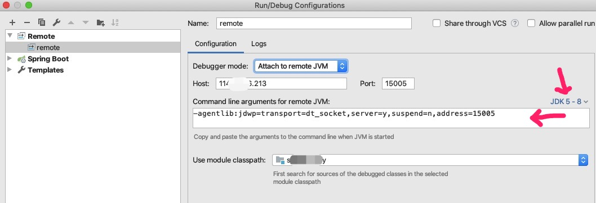

**远程调试Java应用**

## 背景-为什么这么做

如果是本地环境，可以直接使用IntellJ Idea等跑程序，进行debug。

如果应用不在本地，又想调试呢？

远程应用看日志，大多情况下是可以的。但是调试还是少不了的。


## 方案-怎么做

使用jvm的debugger

* 配置本地IDE

  菜单Run -> Edit Configuration -> + -> Remote

  

* 配置远程服务

  * tomcat war应用

    https://blog.csdn.net/lvshow/article/details/82491785 (windows)

    https://www.cnblogs.com/summertime-wu/p/9484420.html (linux)

    * 编辑 Tomcat 执行程序 

    ```
    vim /usr/program/tomcat7/bin/catalina.sh
    ```

    * 查找 /JPDA_ADDRESS= 并修改对应的端口

    * 在bin目录下执行命令 `sh catalina.sh jpda start` ，可以启动tomcat并开启远程调试的端口

      > 其实官方教程是在文件的开头加上 `export JAVA_OPTS='-agentlib:jdwp=transport=dt_socket,server=y,suspend=n,address=5005'` ，但是我不想让其他同事也是以debug模式启动。

    

  * jetty war应用

    https://www.cnblogs.com/summertime-wu/p/9484420.html (linux)

    jetty 不像Tomcat那样需要安装，只要有jetty的jar包就可以启动我们想要启动的应用

    在启动应用的时候，使用如下命令
   ```shell
  java -agentlib:jdwp=transport=dt_socket,server=y,suspend=n,address=5005 -jar {your jetty path} {your port} --path {your war} 1>/dev/null 2>&1 & 
   ```

  * jar包启动的应用

    https://blog.csdn.net/xiaolinzi176/article/details/81490954

    启动命令，添加 idea上提示的参数。比如我的是jdk8，命令为：

    ```shell
  java -agentlib:jdwp=transport=dt_socket,server=y,suspend=n,address=15005 -jar springX-1.0-SNAPSHOT.jar
    ```

    > 不同jvm版本，参数不同。具体根据Idea上的红色箭头提示区域获取。

* 启动远程服务

  按上述要求，修改命令并启动

* 打断点 & 触发 & 调试


> 如果是专门的开发测试环境，可以用偷懒的方式。在/etc/profile设置全局起效的flag
> 然后每个启动sh中根据flag来决定是否加入export JAVA_OPTS


## 准备工作

* 确保网络

  telnet ip port试试是否可连通


## 原理

JVM (略)


## 常见问题

**Q**: 

unable to open debugger port ... Connection Refused

Ans: 

查看服务是否启动成功？

> Ps -ef | grep java | grep myapp

查看网络端口是否连通

> netstat -anp | grep 15005

如果是ip访问，需要查看启用的是tcp还是tcp6？

> 用上一个命令，可以看到
>
> 如果客户端用的是ipv4,但是服务端是ipv6。那么java -jar命令上加上参数
>
> ```
> -Djava.net.preferIPv4Stack=true
> ```


**Q**: 

服务在本地是好的(能访问，有正确response)，在其他机器上无法访问？

Ans： 

检查应用的配置文件。

用么用固定ip，要用0.0.0.0

如果用localhost或者127.0.0.1，而不是0.0.0.0，那么非本机是无法访问的。


Q: 

严格按照上述要求来做了，但是本地还是收到  unable to open debugger port ... Connection Refused

Ans：

-agentlib这个参数，要在-jar参数之前。

比如

java -agentlib:jdwp=transport=dt_socket,server=y,suspend=n,address=15005 -jar springX-1.0-SNAPSHOT.jar

是OK的

而

java -jar springX-1.0-SNAPSHOT.jar -agentlib:jdwp=transport=dt_socket,server=y,suspend=n,address=15005 

是不行的。